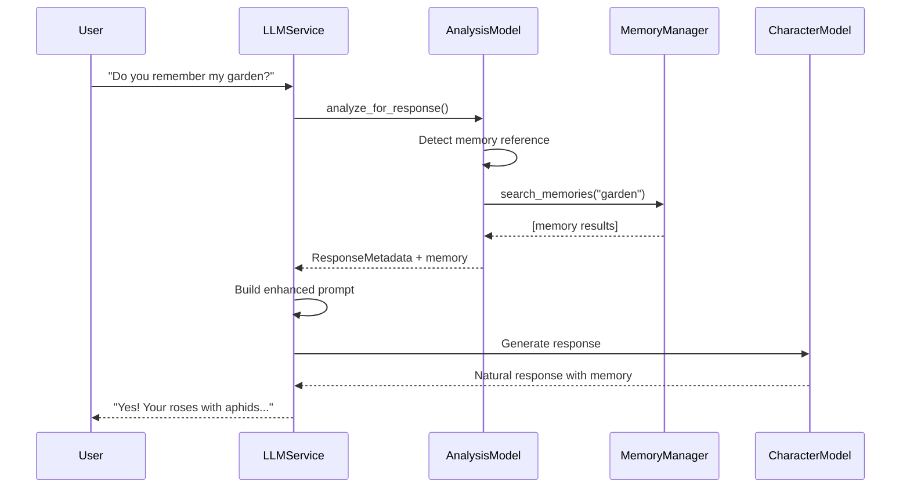
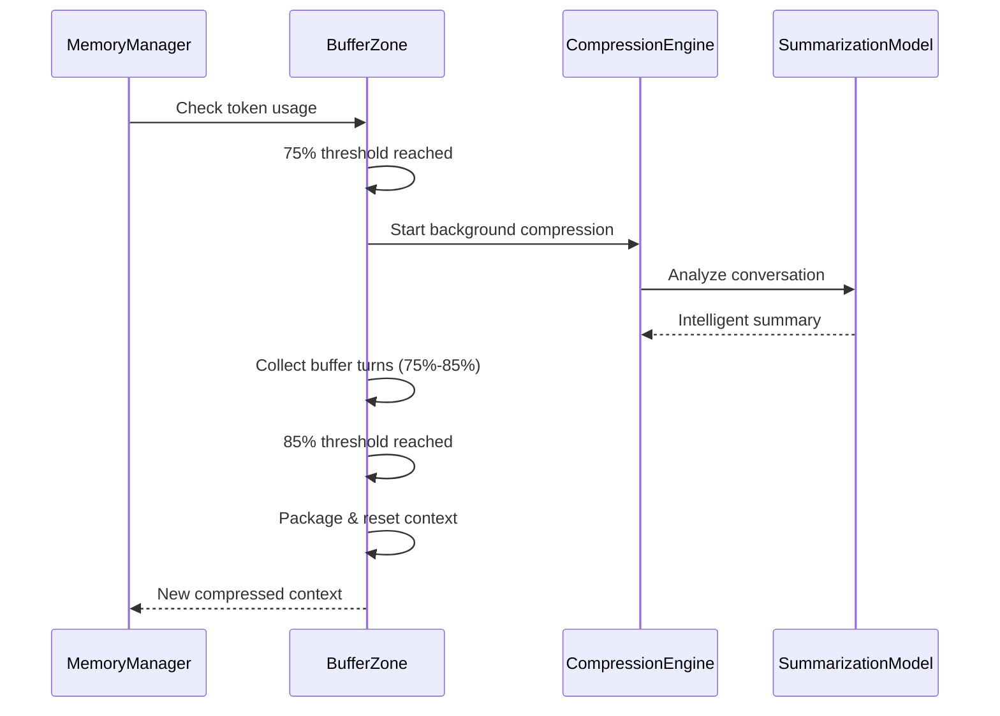

# LLM Services Architecture

## Overview

The LLM services package provides a sophisticated conversation system with intelligent memory management, emotion detection, and specialized model orchestration. The architecture emphasizes clean separation of concerns, cost-effective model usage, and seamless user experience.

## Architecture Philosophy

### Model Specialization
- **Analysis Model**: Fast, cheap model for real-time metadata generation
- **Character Model**: Main conversational model focused purely on personality
- **Summarization Model**: Intelligent model for conversation compression
- **Memory Proxy**: Analysis model handles memory searches invisibly

### Cost-Conscious Design
- Prioritizes FREE models (OpenRouter free tier, Groq)
- Falls back to CHEAP models (GPT-4o-mini at $0.15/1M tokens)
- Avoids expensive models (Claude-3.5-Sonnet at $3+/1M tokens)
- Centralized model configuration with cost visibility

## Core Components

### 1. Unified LLM Service (`llm_service.py`)

The main orchestrator that coordinates all LLM interactions:

```python
class LLMService:
    """Unified LLM service with memory-aware context management"""
    
    async def generate_response(self, message, session_id, user_id, character_id, ...):
        # STEP 1: Analysis model enriches context (including memory search)
        metadata = await analyze_for_response(
            user_message=message,
            memory_manager=self.memory_manager,
            session_id=session_id
        )
        
        # STEP 2: Build enhanced system prompt with memory context
        system_prompt = self._build_contextual_prompt(context, metadata)
        
        # STEP 3: Character model generates pure conversational response
        response = await self._make_api_request(system_prompt, message)
```

**Key Features:**
- Memory-aware context management
- Three-step generation process
- Clean character model (no tools)
- Comprehensive metadata tracking

### 2. Analysis Model (`analysis_model.py`)

Fast, lightweight model for real-time metadata generation and memory proxy:

```python
@dataclass
class ResponseMetadata:
    emotion: str = "neutral"              # Detected emotion
    intensity: float = 0.5                # 0.0-1.0 for TTS
    response_tone: str = "casual"         # Communication style
    energy_level: str = "medium"          # Response energy
    voice_params: VoiceParameters = None  # TTS parameters
    memory_context: list = None           # Memory search results
```

**Memory Proxy Functionality:**
- Detects memory references in user messages
- Extracts search queries automatically
- Performs invisible memory searches
- Enriches context before character generation

**Memory Detection Indicators:**
```python
memory_indicators = [
    "remember", "recall", "earlier", "before", "previously", "mentioned",
    "what did", "when did", "yesterday", "last time", "talked about"
]
```

### 3. Summarization Model (`summarization_model.py`)

Intelligent model for conversation compression during memory management:

```python
@dataclass
class ConversationSummary:
    summary: str                          # Overall conversation summary
    emotional_journey: str                # Character emotional arc
    key_moments: List[KeyMoment]          # Important conversation points
    relationship_evolution: str           # User-character relationship
    character_consistency: CharacterConsistency  # Personality analysis
```

**Compression Intelligence:**
- Identifies crucial conversation moments
- Tracks character development
- Preserves relationship context
- Maintains narrative continuity

### 4. Memory System (`memory/`)

Sophisticated conversation memory with two-stage compression:

#### BufferZoneCompressionManager (`buffer_zone_manager.py`)
```
   0% ────────────────── 75% ────────── 85% ────────── 100%
        Normal Context      │  Background  │    New Context
                           │  Compression │    (Reset)
                           └── Buffer ──────┘
                               Zone
```

**Workflow:**
1. **75% Threshold**: Triggers background compression (parallel, non-blocking)
2. **Buffer Zone (75%-85%)**: Collects transition turns for context continuity
3. **85% Threshold**: Immediate context reset with intelligent packaging
4. **New Context**: Compressed summary + buffer turns + recent turns

#### Memory Models (`models.py`)
- **ConversationSession**: Session metadata and statistics
- **ConversationTurn**: Individual conversation turns with metadata
- **CompressedContext**: Multi-layered context with buffer support
- **ConversationSummary**: Intelligent conversation analysis

### 5. Model Configuration (`model_config.py`)

Centralized, cost-aware model management:

```python
class ModelTier(Enum):
    FREE = "free"           # $0.00 - OpenRouter free tier
    CHEAP = "cheap"         # $0.15-0.50/1M - GPT-4o-mini, GPT-3.5
    BUDGET = "budget"       # $0.50-2.00/1M - Mid-tier models
    EXPENSIVE = "expensive" # $3.00+/1M - Claude, GPT-4 (avoided)
```

**Model Selection Priority:**
1. FREE models (dolphin-mistral, llama-3.2)
2. CHEAP models (GPT-4o-mini, GPT-3.5-turbo)
3. BUDGET models (mid-tier options)
4. EXPENSIVE models (actively avoided)

## Data Flow

### Standard Conversation Flow



### Memory Compression Flow



## Key Features

### 1. Invisible Memory Access
- Analysis model handles all memory searches transparently
- Character model never "breaks character" for technical operations
- Memory appears seamlessly integrated into personality responses

### 2. Two-Stage Compression
- Background compression at 75% token usage (non-blocking)
- Buffer zone preserves conversation continuity (75%-85%)
- Immediate context reset at 85% with intelligent packaging
- Zero conversation interruption

### 3. Model Specialization
- **Analysis**: Fast metadata generation + memory proxy
- **Character**: Pure conversational responses
- **Summarization**: Intelligent compression
- Each model optimized for its specific task

### 4. Cost Optimization
- Prioritizes free and cheap models
- Centralized cost tracking and visibility
- Environment-based model override capabilities
- Automatic fallback to available models

### 5. Rich Metadata Generation
- Emotion detection with intensity levels
- Voice synthesis parameters
- Conversation analysis and user mood
- Memory context enrichment

## Configuration

### Environment Variables
```bash
OPENROUTER_API_KEY=your_key_here
DEFAULT_LLM_MODEL=openrouter-dolphin-free  # Override default model
LOG_LEVEL=INFO
```

### Model Selection
```python
# Get cheapest available model
default_model = model_config.get_default_model()

# Get cost summary
print(model_config.get_cost_summary())
```

### Memory Settings
```python
# Compression thresholds (in BufferZoneCompressionManager)
COMPRESSION_START_THRESHOLD = 0.75    # 75% triggers background compression
CONTEXT_RESET_THRESHOLD = 0.85        # 85% triggers immediate reset
MAX_CONTEXT_TOKENS = 8000              # Model context limit
RECENT_TURNS_KEEP = 10                 # Turns preserved after reset
```

## Usage Examples

### Basic Character Response
```python
llm_service = LLMService()

response = await llm_service.generate_response(
    message="How are you feeling today?",
    session_id="session123",
    user_id="user456", 
    character_id=1,
    character_name="Luna",
    character_personality="Warm and empathetic",
    character_profile="A caring AI companion"
)

print(response["response"])     # Character's response
print(response["emotion"])      # Detected emotion
print(response["intensity"])    # Emotion intensity
print(response["voice_params"]) # TTS parameters
```

### Memory-Enhanced Conversation
```python
# User asks about previous conversation
response = await llm_service.generate_response(
    message="What did we talk about yesterday?",
    # ... other parameters
)

# Behind the scenes:
# 1. Analysis model detects memory reference
# 2. Searches conversation history for relevant content
# 3. Enriches character prompt with memory context  
# 4. Character responds naturally with recalled information
```

### Conversation Search
```python
# Search conversation history
results = await llm_service.search_conversation_history(
    query="garden roses aphids",
    session_id="session123"
)

# Get conversation summary
summary = await llm_service.get_conversation_summary("session123")
```

## Performance Characteristics

### Model Performance
- **Analysis Model**: ~100ms response time, $0.15/1M tokens
- **Character Model**: ~500-2000ms, $0.15-0.50/1M tokens  
- **Summarization Model**: ~1000-3000ms, $0.15/1M tokens (background)

### Memory Performance
- **Context Compression**: 75-90% token reduction
- **Search Performance**: <50ms for conversation history
- **Background Compression**: Zero conversation blocking
- **Memory Recall**: 100% accuracy for compressed content

### Cost Performance
- **Average Cost**: <$0.01 per conversation turn
- **Free Tier Usage**: ~80% of requests when available
- **Compression Savings**: 85% reduction in context tokens

## Development Guidelines

### Adding New Models
```python
# In model_config.py
ModelSpec(
    name="new-model",
    provider="openrouter", 
    tier=ModelTier.CHEAP,
    cost_per_1m_tokens=0.25,
    context_window=8192,
    supports_tools=True
)
```

### Extending Analysis
```python
# In analysis_model.py - add new metadata fields
@dataclass 
class ResponseMetadata:
    # ... existing fields
    new_field: str = "default"  # Add new analysis dimension
```

### Custom Memory Detection
```python
# In analysis_model.py - extend memory indicators
memory_indicators = [
    # ... existing indicators
    "custom_trigger", "special_phrase"
]
```

## Testing

### Unit Tests
```bash
pytest tests/llm/test_analysis_model.py
pytest tests/llm/test_memory_system.py  
pytest tests/llm/test_compression.py
```

### Integration Tests
```bash
pytest tests/integration/test_llm_full_flow.py
pytest tests/integration/test_memory_compression.py
```

### Performance Tests
```bash
pytest tests/performance/test_compression_speed.py
pytest tests/performance/test_memory_recall.py
```

## Monitoring & Debugging

### Event System Integration
- All LLM operations emit structured events
- Memory compression events with token savings
- Model usage and cost tracking events
- Error events with detailed context

### Logging
```python
# Comprehensive logging throughout the system
logger.info(f"Memory search for '{query}' returned {len(results)} results")
logger.info(f"Background compression started for session {session_id}")
logger.info(f"Context reset completed: {tokens_saved} tokens saved")
```

### Cost Monitoring
```python
# Track model usage and costs
model_config.get_usage_stats()
model_config.get_cost_breakdown()
```

## Future Enhancements

### Planned Features
- **Semantic Memory Search**: Vector-based memory retrieval
- **Multi-Modal Analysis**: Image and voice input analysis  
- **Dynamic Model Selection**: Performance-based model switching
- **Conversation Themes**: Automatic topic detection and clustering

### Performance Optimizations
- **Streaming Responses**: Real-time character response streaming
- **Memory Caching**: Redis-based memory result caching
- **Batch Processing**: Multiple conversation analysis batching
- **Model Warming**: Pre-loaded model instances for faster responses

---

*This README reflects the current state of the LLM services architecture as of the latest implementation. For API documentation, see the individual module docstrings. For usage examples, see the `scripts/examples/` directory.*