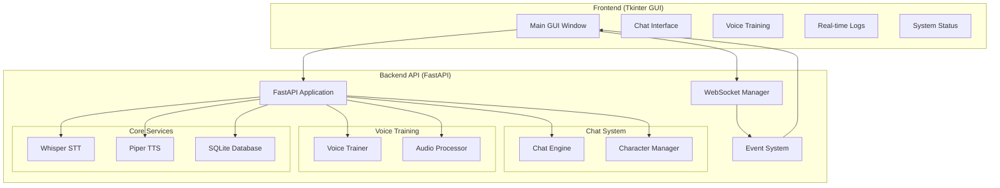
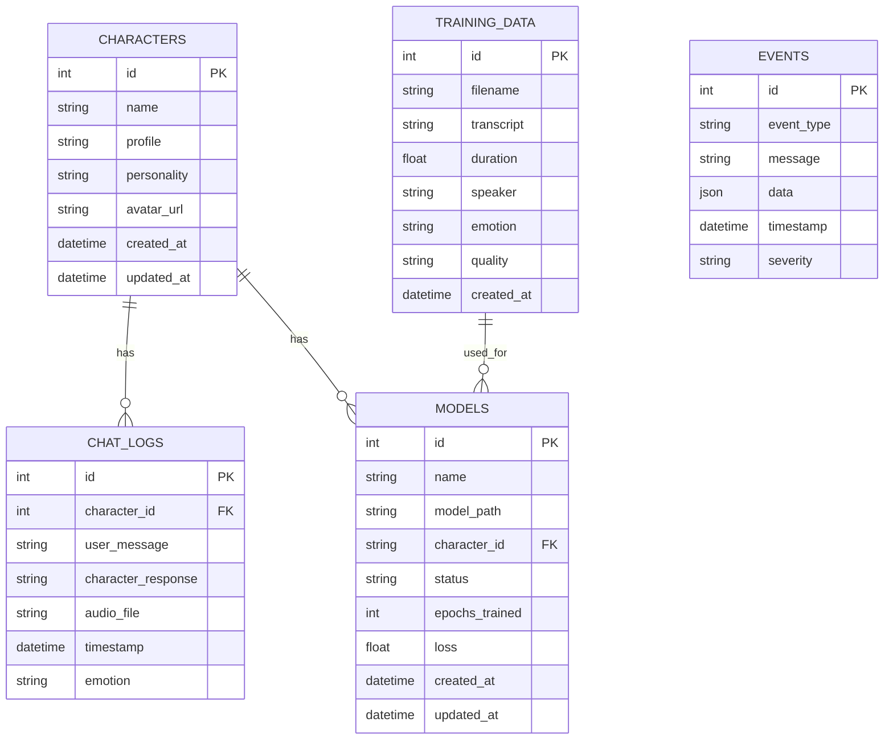

# VTuber Project Reimplementation Plan

## Project Overview

This document outlines the comprehensive plan for reimplementing the VTuber streaming application with voice cloning capabilities, real-time chat functionality, and a debugging GUI interface.

## Architecture Overview



## System Components

### 1. Frontend (Tkinter GUI)
**Purpose**: Debugging command center and user interface
**Features**:
- Real-time chat interface with character switching
- Voice training management interface
- Live system monitoring and logs
- Status dashboard with system metrics
- Audio controls and settings

### 2. Backend API (FastAPI)
**Purpose**: Core application logic and API endpoints
**Structure**:
- RESTful API endpoints for all operations
- WebSocket support for real-time communication
- Event-driven architecture for system notifications

### 3. Audio Processing Pipeline
**Speech-to-Text**: Whisper integration for converting speech to text
**Text-to-Speech**: Piper integration for natural voice synthesis
**Audio Processing**: Custom audio processing for training data preparation

### 4. Database System
**Database**: SQLite for simplicity and portability
**Tables**:
- `characters` - Character profiles and metadata
- `chat_logs` - Chat history and interactions
- `training_data` - Voice training samples and metadata
- `models` - Trained voice model checkpoints
- `events` - System event logs

### 5. Event System
**Purpose**: Real-time notifications and system monitoring
**Event Types**:
- Chat messages and responses
- Training progress updates
- System status changes
- Error notifications
- Audio processing events

## Detailed Implementation Plan

### Phase 1: Project Structure and Configuration

#### 1.1 Directory Structure
```
VtuberMiku/
├── .env
├── .env.example
├── requirements.txt
├── main.py                 # Application entry point
├── config.py              # Configuration management
├── database.py            # Database models and connections
├── event_system.py        # Event handling and WebSocket management
├── backend/
│   ├── __init__.py
│   ├── api/
│   │   ├── __init__.py
│   │   ├── main.py        # FastAPI application
│   │   ├── routes/
│   │   │   ├── __init__.py
│   │   │   ├── chat.py    # Chat endpoints
│   │   │   ├── voice.py   # Voice training endpoints
│   │   │   ├── system.py  # System management endpoints
│   │   │   └── websocket.py # WebSocket handlers
│   │   ├── models/
│   │   │   ├── __init__.py
│   │   │   ├── schemas.py  # Pydantic models
│   │   │   └── database.py # Database models
│   │   └── services/
│   │       ├── __init__.py
│   │       ├── whisper_service.py
│   │       ├── piper_service.py
│   │       ├── chat_service.py
│   │       └── voice_service.py
│   ├── chat/
│   │   ├── __init__.py
│   │   ├── engine.py      # Chat processing engine
│   │   ├── characters/
│   │   │   ├── __init__.py
│   │   │   ├── loader.py  # Character loading and management
│   │   │   └── models.py  # Character data models
│   │   └── llm/
│   │       ├── __init__.py
│   │       └── provider.py # LLM integration
│   ├── voice_trainer/
│   │   ├── __init__.py
│   │   ├── train_voice.py
│   │   ├── audio_processor.py
│   │   ├── config.py
│   │   └── training_data/
│   └── audio/
│       ├── __init__.py
│       ├── processor.py   # Audio utilities
│       └── models.py      # Audio data models
├── frontend/
│   ├── __init__.py
│   ├── gui.py            # Main GUI application
│   ├── components/
│   │   ├── __init__.py
│   │   ├── chat_interface.py
│   │   ├── training_interface.py
│   │   ├── log_viewer.py
│   │   └── status_dashboard.py
│   └── utils/
│       ├── __init__.py
│       ├── websocket_client.py
│       └── audio_controls.py
├── models/
│   ├── piper/            # Piper TTS models
│   └── whisper/          # Whisper models
├── logs/                 # Application logs
├── data/                 # User data and configurations
└── tests/                # Unit and integration tests
```

#### 1.2 Configuration Files
- **requirements.txt**: Python dependencies
- **config.py**: Application configuration management
- **.env.example**: Environment variables template

### Phase 2: Backend API Implementation

#### 2.1 Core FastAPI Application
- **File**: `backend/api/main.py`
- **Features**:
  - CORS middleware configuration
  - WebSocket endpoint setup
  - Event system integration
  - Dependency injection for services

#### 2.2 REST API Endpoints
- **Chat Endpoints** (`backend/api/routes/chat.py`):
  - `GET /api/characters` - List available characters
  - `GET /api/characters/{id}` - Get character details
  - `POST /api/chat` - Send chat message
  - `POST /api/switch_character` - Switch active character
  - `POST /api/tts` - Text-to-speech generation

- **Voice Training Endpoints** (`backend/api/routes/voice.py`):
  - `POST /api/voice/upload` - Upload training audio
  - `POST /api/voice/process` - Process uploaded audio
  - `GET /api/voice/clips` - List training clips
  - `POST /api/voice/train` - Start voice training
  - `GET /api/voice/checkpoints` - List model checkpoints

- **System Endpoints** (`backend/api/routes/system.py`):
  - `GET /api/status` - System status
  - `GET /api/health` - Health check
  - `POST /api/config` - Update configuration

#### 2.3 WebSocket Implementation
- **File**: `backend/api/routes/websocket.py`
- **Features**:
  - Real-time chat messages
  - Training progress updates
  - System event notifications
  - Error alerts

#### 2.4 Service Layer
- **Whisper Service** (`backend/api/services/whisper_service.py`):
  - Speech-to-text conversion
  - Language detection
  - Audio preprocessing

- **Piper Service** (`backend/api/services/piper_service.py`):
  - Text-to-speech synthesis
  - Voice model management
  - Audio output generation

- **Chat Service** (`backend/api/services/chat_service.py`):
  - Message processing
  - Character response generation
  - Chat history management

- **Voice Service** (`backend/api/services/voice_service.py`):
  - Voice training coordination
  - Model management
  - Training progress tracking

### Phase 3: Database Implementation

#### 3.1 Database Schema


#### 3.2 Database Models
- **File**: `backend/api/models/database.py`
- **Features**:
  - SQLAlchemy ORM models
  - Database connection management
  - Migration support

### Phase 4: Frontend GUI Implementation

#### 4.1 Main GUI Application
- **File**: `frontend/gui.py`
- **Features**:
  - Main window with tabbed interface
  - WebSocket connection management
  - Event subscription and display
  - System tray integration

#### 4.2 GUI Components
- **Chat Interface** (`frontend/components/chat_interface.py`):
  - Message display area
  - Input field with send button
  - Character selection dropdown
  - Audio controls

- **Training Interface** (`frontend/components/training_interface.py`):
  - File upload widget
  - Training progress bar
  - Clip management interface
  - Model checkpoint viewer

- **Log Viewer** (`frontend/components/log_viewer.py`):
  - Real-time log display
  - Log level filtering
  - Search functionality
  - Auto-scroll option

- **Status Dashboard** (`frontend/components/status_dashboard.py`):
  - System metrics display
  - Service status indicators
  - Resource usage monitoring
  - Configuration overview

#### 4.3 WebSocket Client
- **File**: `frontend/utils/websocket_client.py`
- **Features**:
  - WebSocket connection management
  - Event message handling
  - Reconnection logic
  - Error handling

### Phase 5: Event System Implementation

#### 5.1 Event Management
- **File**: `event_system.py`
- **Features**:
  - Event publishing and subscription
  - WebSocket event broadcasting
  - Event filtering and routing
  - Logging and persistence

#### 5.2 Event Types
```python
class EventType:
    # Chat events
    CHAT_MESSAGE = "chat.message"
    CHAT_RESPONSE = "chat.response"
    CHARACTER_SWITCHED = "character.switched"
    
    # Voice training events
    TRAINING_STARTED = "training.started"
    TRAINING_PROGRESS = "training.progress"
    TRAINING_COMPLETED = "training.completed"
    TRAINING_FAILED = "training.failed"
    
    # System events
    SYSTEM_STATUS = "system.status"
    ERROR_OCCURRED = "error.occurred"
    AUDIO_PROCESSED = "audio.processed"
    
    # Model events
    MODEL_LOADED = "model.loaded"
    MODEL_SAVED = "model.saved"
    MODEL_FAILED = "model.failed"
```

### Phase 6: Integration and Testing

#### 6.1 Integration Points
- **Audio Pipeline**: Whisper ↔ Chat Engine ↔ Piper
- **Database**: All services connected to SQLite
- **Event System**: Real-time updates across all components
- **WebSocket**: Frontend-backend communication

#### 6.2 Testing Strategy
- **Unit Tests**: Individual service testing
- **Integration Tests**: API endpoint testing
- **WebSocket Tests**: Real-time communication testing
- **End-to-End Tests**: Complete workflow testing

## Implementation Timeline

### Week 1: Foundation and Structure
- [ ] Create project directory structure
- [ ] Set up configuration files
- [ ] Implement basic FastAPI application
- [ ] Create database models and schema

### Week 2: Core Services
- [ ] Implement Whisper service
- [ ] Implement Piper service
- [ ] Create chat service
- [ ] Implement voice training service

### Week 3: API Development
- [ ] Implement REST API endpoints
- [ ] Create WebSocket handlers
- [ ] Build event system
- [ ] Integrate all services

### Week 4: Frontend Development
- [ ] Create main GUI application
- [ ] Implement chat interface
- [ ] Build training interface
- [ ] Create log viewer and status dashboard

### Week 5: Integration and Testing
- [ ] Integrate frontend with backend
- [ ] Test complete workflows
- [ ] Debug and optimize performance
- [ ] Create documentation

## Dependencies and Requirements

### Python Packages
```
fastapi==0.104.1
uvicorn[standard]==0.24.0
websockets==12.0
sqlalchemy==2.0.23
pydantic==2.5.0
python-multipart==0.0.6
python-dotenv==1.0.0
openai-whisper==20231117
Piper-TTS==1.1.0
librosa==0.10.1
soundfile==0.12.1
torch==2.1.1
torchaudio==2.1.1
numpy==1.24.3
pandas==2.1.4
tkinter
```

### System Requirements
- Python 3.10+
- FFmpeg (for audio processing)
- CUDA-compatible GPU (optional, for faster Whisper processing)
- Sufficient disk space for voice models

## Deployment and Configuration

### Environment Variables
```bash
# API Configuration
API_HOST=localhost
API_PORT=8765
DEBUG=true

# Database
DATABASE_URL=sqlite:///./vtuber.db

# Audio Settings
WHISPER_MODEL=base
PIPER_MODEL_PATH=models/piper/en_US-amy-medium.onnx
SAMPLE_RATE=16000
CHANNELS=1

# Logging
LOG_LEVEL=INFO
LOG_FILE=logs/vtuber.log

# OpenRouter API (for LLM integration)
OPENROUTER_API_KEY=your_key_here
OPENROUTER_MODEL=qwen/qwen-2.5-7b-instruct
```

### Running the Application
```bash
# Install dependencies
pip install -r requirements.txt

# Copy environment file
cp .env.example .env

# Start the backend
python main.py

# Start the frontend (in separate terminal)
python frontend/gui.py
```

## Monitoring and Debugging

### Logging System
- **File-based logging**: All system events logged to files
- **GUI logging**: Real-time log display in frontend
- **Log levels**: DEBUG, INFO, WARNING, ERROR
- **Log rotation**: Automatic log file management

### Monitoring Features
- **System status**: Real-time service health monitoring
- **Performance metrics**: CPU, memory, and disk usage tracking
- **Event monitoring**: Live event stream in GUI
- **Error tracking**: Comprehensive error logging and alerts

## Security Considerations

- **API Security**: Input validation and sanitization
- **File Security**: Secure file upload and processing
- **Data Privacy**: Local data storage with encryption options
- **Access Control**: User authentication and authorization (future enhancement)

## Future Enhancements

1. **User Authentication**: Multi-user support with profiles
2. **Model Marketplace**: Share and download voice models
3. **Streaming Integration**: OBS/Twitch streaming integration
4. **Mobile App**: Cross-platform mobile companion app
5. **Cloud Storage**: Cloud backup and synchronization
6. **Advanced Analytics**: Usage statistics and insights

This comprehensive plan provides a solid foundation for rebuilding your VTuber project with all the requested features including Whisper integration, Piper TTS, comprehensive event system, and a Tkinter-based debugging GUI.